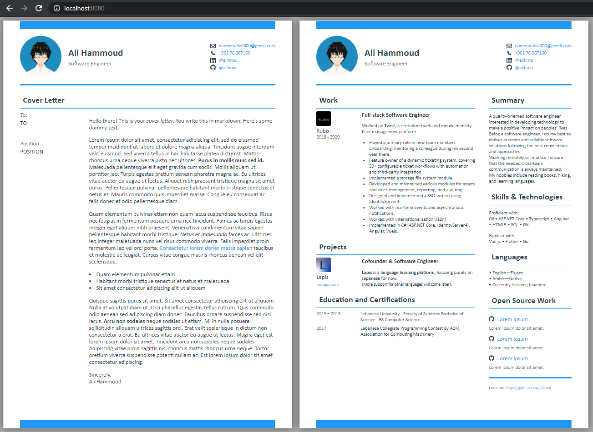
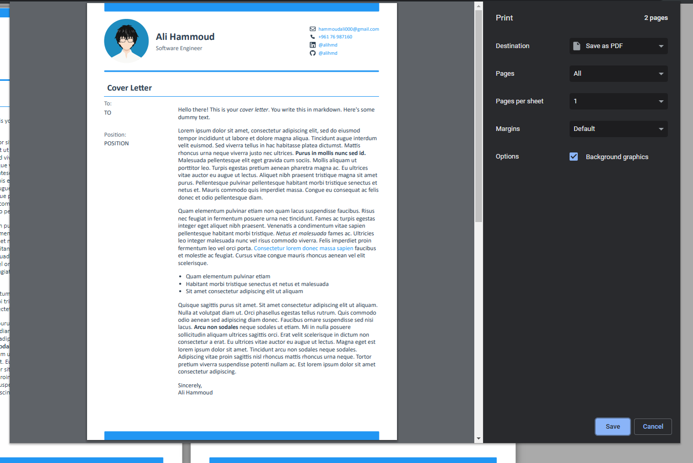

# cv

A CV built as a web app and prints perfectly on A4 papers.





## Overview

- Perfect print to A4. This is just a web app that's made to be printable, you'll see exactly what will be printed.
- Set quick data (name, website, etc) in a json file, and larger texts (like your cover letter) in a markdown file. The app knows how to pull its data from those.
- This serves as a CV template example. You can clone this and change it however you like.

## Configuration

Configurable things are all put under [src/content](src/content):

- [config.json](src/content/config.json): Contains quick data and some configuration options
- [certs.md](src/content/certs.md): Education and certifications you've gained
- [cover-letter.md](src/content/cover-letter.md): Your cover letter
- [languages.md](src/content/languages.md): Languages proficiency
- [oss-projects.json](src/content/oss-projects.json): Contains open source projects you want to display
- [skills.md](src/content/skills.md): Skills and technologies you know
- [summary.md](src/content/summary.md): A small intro about yourself
- [work.md](src/content/work.md): Past and current work experience

Your picture is at [src/assets/pic.png](src/assets/pic.png).

> Tip: You can choose not to show your picture or make it grayscale by setting `pictureHidden` and `grayscalePicture` to `true` in [config.json](src/content/config.json).

## Run
```
npm install
```

```
npm start
```

Then open http://localhost:8080.

## Print

Hit Ctrl+P in google chrome and print to pdf or a printer.

---

### (This is forked from [cv](https://www.github.com/mrahhal/cv), credits to [@mrahhal](https://www.github.com/mrahhal))
